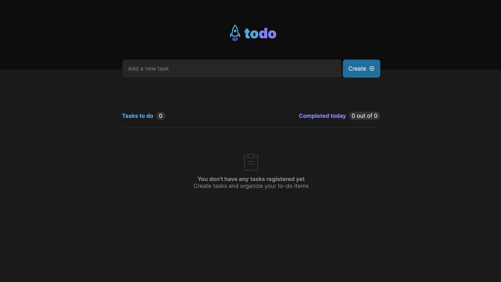

# To-Do List App

This is a simple to-do list application, developed in React and TypeScript, that allows adding, marking and unmarking as completed, removing tasks, and showing the progress of completion of tasks.

## Features

- Add a new task: simply type the desired task in the input field and press Enter.
- Mark and unmark a task as completed: click on the check button next to the task to mark or unmark as completed.
- Remove a task from the list: click on the trash button next to the task to remove from the list.
- Show the progress of completion of tasks: it displays the number of completed tasks and the total number of tasks at the top of the list.

## Concepts used

The project uses the following concepts of React and TypeScript:

- States: the component state is used to store the list of tasks.
- Immutability of state: to update the component state, the immutability of state is used to ensure that updates are performed in a safe and predictable manner.
- Lists and keys in ReactJS: the list of tasks is displayed using the `map()` method of JavaScript and it is necessary to use a unique key for each item in the list in order to optimize performance and avoid errors.
- Properties: the task list component receives a `tasks` property, which is an array of objects representing each task.
- Componentization: the project is divided into reusable components, such as the task input component, the task list component, the individual task component, and the counter component.
